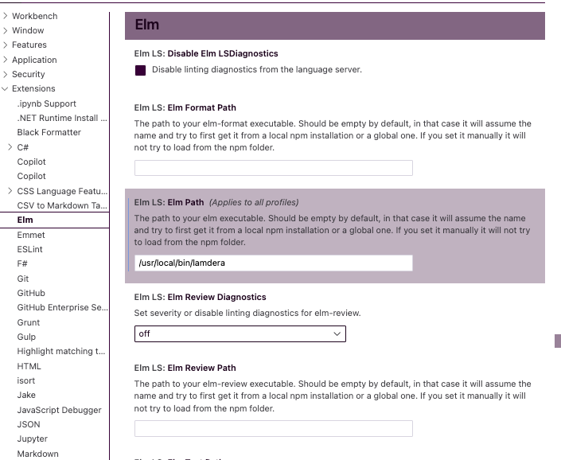

# How to Contribute

## Overview
This project is written almost entirely in [Elm](https://elm-lang.org/) aka elmlang, a strongly typed, functional language optimized for web development.

Specifically, we're using a platform called [Lamdera](https://dashboard.lamdera.app/docs/overview) which lets us write both our Frontend _and_ our Backend code in Elm.

## Steps to get working

1. Create a local clone of this repo on your machine.  
2. [Download latest version of Lamdera](https://dashboard.lamdera.app/docs/download).  You'll be using Lamdera instead of the native Elm binary. (At the time of creating project current version is 1.2.0)

For Mac, you would use
```
curl https://static.lamdera.com/bin/lamdera-1.2.0-macos-x86_64 -o /usr/local/bin/lamdera
chmod a+x /usr/local/bin/lamdera
```
For Windows, download and unpack to the directory of your choice.
```
https://static.lamdera.com/bin/lamdera-1.2.0-windows-x86_64.zip
```

3. Go to your VS CODE settings and find the Elm extension. In the section `Elm LS: Elm Path`, insert the path to your lamdera install directory.  

  
4. If you're using Visual Studio Code, install the Elmlang extension.  
**Note**: There are two language extensions in the VSCode ecosystem but older (seemingly more popular one) has been deprecated. Pick one marked with arrow on image.


5. Install **elm-format** and **elm-test**.  In your terminal or some other shell environment, type
```
npm install -g elm-format elm-test
```
6. At this point, you should be able to get a local server up and running with the project. Type in terminal: 

```
lamdera live
```
and you are good to go!